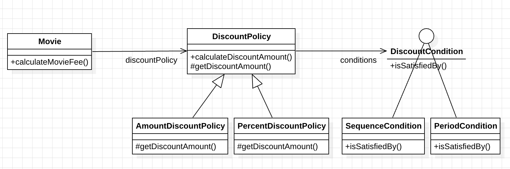
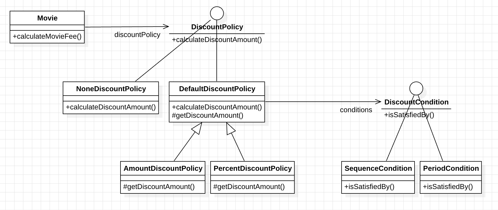

# Chapter 02: 객체지향 프로그래밍

이번 장에서는 객체지향 설계에 필요한 **협력**에 대해 이해하고, **상속**, **다형성**, **추상화**에 대해서 알아본다.  
그리고 **상속**과 **합성**의 차이를 알아보고 둘을 어떻게 활용해야 하는지에 대해서 설명한다.

## 1. 영화 예매 시스템

### 요구사항 살펴보기

- 영화
  - 영화에 대한 기본정보를 표현
  - `제목`, `상영시간`, `가격` 정보
- 상영
  - 관객들이 영화를 관람하는 사건을 표현
  - `상영 일자`, `시간`, `순번`
- 할인 조건
  - 가격의 할인 여부를 결정
  - `순서 조건`, `기간 조건`
- 할인 정책
  - 할인 요금을 결정
  - `금액 할인 정책`, `비율 할인 정책`

할인 정책은 영화마다 하나만 지정 가능하다.  
그리고 각 할인 정책은 여러 개의 할인 조건을 가질 수 있다.

| 영화                      | 할인 정책              | 할인 조건                                       |
| ------------------------- | ---------------------- | ----------------------------------------------- |
| 아바타 (가격: 10,000원)   | 금액 할인 정책 (800원) | 순번 조건 (조조 상영)                           |
|                           |                        | 순번 조건 (10회 상영)                           |
|                           |                        | 기간 조건 (월요일 10:00 ~ 12:00 사이 상영 시작) |
|                           |                        | 기간 조건 (목요일 18:00 ~ 21:00 사이 상영 시작) |
| 타이타닉 (가격: 11,000원) | 비율 할인 정책 (10%)   | 기간 조건 (화요일 14:00 ~ 17:00 사이 상영 시작) |
|                           |                        | 순번 조건 (2회 상영)                            |
|                           |                        | 기간 조건 (목요일 10:00 ~ 14:00 사이 상영 시작) |
| 스타워즈 (가격: 10,000원) | 없음                   | 없음                                            |

## 2. 객체지향 프로그래밍을 향해

### 협력, 객체, 클래스

객체지향 프로그래밍을 할 때, 가장 먼저 **어떤 `클래스`가 필요한지** 고민할 것이다.

- 대개 **클래스를 결정한 후**에 **클래스에 어떤 속성과 메서드가 필요한지** 고민한다.

⭐️ 하지만 어떤 클래스가 필요한지보다 앞서야 하는 고민은 **어떤 객체가 필요하냐는 것**이다.

```md
진정한 객체지향 패러다임으로의 전환은 클래스가 아닌 `객체`에 초점을 맞출 때에만 얻을 수 있다.
```

#### 1. 어떤 객체들이 필요한지 고민하라

- 클래스는 공통적인 상태와 행동을 공유하는 객체들을 `추상화한 것`이다.

#### 2. 객체를 독립적인 존재가 아닌, 기능을 구현하기 위해 협력하는 공동체의 일원으로 봐야 한다.

- 훌륭한 협력이 훌륭한 객체를 낳는다.
- 훌륭한 객체는 훌륭한 클래스를 낳는다.

> 클래스를 작성하기에 앞서서, 객체를 중심에 두는 접근 방법이 중요하다.  
> 👉🏻 클래스는 `객체`를 추상화 한 것이기 때문에, **도메인에 맞춰서 객체를 먼저 설계하는 것**이 더 객체지향다운 설계를 돕는다.

### 도메인의 구조를 따르는 프로그램 구조

> **도메인**  
> 문제를 해결하기 위해 사용자가 프로그램을 사용하는 분야

객체지향의 큰 장점 중 하나는 **요구사항을 분석하는 초기 단계부터 프로그램을 구현하는 마지막 단계까지** `객체`라는 동일한 추상화 기법을 사용할 수 있기 때문이다.

- 객체라는 개념은 우리의 일상을 빗대어 만든 것이기 때문

따라서, **도메인을 구성하는 개념들**이 프로그램의 `객체`와 `클래스`로 매끄럽게 연결될 수 있다.

👉🏻 이 영화 예매 서비스에 필요한 **도메인 다이어그램**은 `교재 41페이지`를 참고한다.

이처럼 `영화 예매 도메인을 구성하는 개념과 관계를 설정`한 후, 이를 **클래스로 구현하는 단계**로 넘어간다.

### 클래스 구현하기

#### [Screening 클래스]()

- 사용자들이 예매하는 대상인 `상영`을 구현한다.
- **상영할 영화, 순번, 상영 시작 시간**을 인스턴스 변수로 갖는다.

여기서 주목할 부분은 인스턴스 변수의 가시성은 `private`이고 메서드의 가시성은 `public`이라는 것이다.

이처럼 외부에서는 객체의 속성에 직접 접근할 수 없도록 막고, 적절한 `public` 메서드를 통해서만 내부 상태를 변경할 수 있게 해야한다.

> 경계를 명확히 구분해야 하는 이유는?  
> 👉🏻 `객체의 자율성`을 보장하기 때문

#### 자율적인 객체

객체 내부에 대한 접근을 통제하는 이유는 객체를 `자율적인 존재`로 만들기 위해서다.  
자율적인 존재로 만들기 위해서는 **외부의 간섭을 최소화해야** 한다.

> 1장의 예시를 생각해볼 때, **객체 내부에 대한 접근**을 너무 풀어버리면 해당 객체는 `수동적인 존재`가 되어버림

- 퍼블릭 인터페이스
  - 외부에서 접근 가능한 부분
- 구현
  - 외부에서 접근 불가능하며 오직 내부에서만 접근 가능한 부분

👉🏻 `인터페이스와 구현의 분리` 원칙은 객체지향의 핵심 원칙이다.

#### 프로그래머의 자유

- 구현 은닉
  - 클래스 작성자는 클라이언트 프로그래머에게 **필요한 부분만 공개**하고, 나머지는 숨겨야 한다.

`구현 은닉`을 통해 *클라이언트*는 내부의 구현을 무시한 채 **`인터페이스`만 알고 있어도 클래스를 사용할 수 있다.**  
*클래스 작성자*는 외부에 주는 영향을 신경쓰지 않고, 내부 구현을 마음대로 변경할 수 있다.

```
[ 인터페이스와 구현의 분리 ]

클래스를 개발할 때마다 인터페이스와 구현을 깔끔하게 분리하기 위해 노력해야 한다.

👉🏻 설계가 필요한 이유는 "변경을 관리하기 위함"이다.
```

### 협력하는 객체들의 공동체

```java
public class Screening {
    public Reservation reserve(Customer customer, int audienceCount) {
        return new Reservation(customer, this, calculateFee(audienceCount), audienceCount);
    }

    private Money calculateFee(int audienceCount) {
        return movie.calculateMovieFee(this).times(audienceCount);
    }
}
```

`Screening` 클래스는 예약 객체를 생성하기 위해

- `Movie`의 `calculateMovieFee` 메서드를 호출한다.
- Movie에게 반환받은 1인당 예매 요금으로 전체 예매 요금을 구하기 위해 `Money`의 `times` 메소드를 호출한다.

#### 객체로 의미를 풍부하게 표현하라

이번 예제에서는 **금액**을 구현하기 위해 `Long` 타입 대신 `Money` 객체를 사용하고 있다.

- 이는 해당 값이 명확하게 _"금액과 연관되어 있음"_ 을 알려준다.

> 👉🏻 이처럼 의미를 좀 더 명시적이고 분명히 표현할 수 있다면, **`객체`를 사용해서 해당 개념을 구현하는 것이 좋다.**
>
> 그 개념이 하나의 인스턴스 변수만 포함하더라도, **개념을 명시적으로 표현하는 것**은 전체적인 설계의 명확성과 유연성을 높여준다.

#### [Reservation 클래스]()

- **고객, 상영 정보, 예매 요금, 인원 수**를 속성으로 포함한다.

이처럼 영화를 예매하기 위해 `Screening`, `Movie`, `Reservation` 인스턴스들은 **서로의 메서드를 호출하며 상호작용**한다.

```
[ 객체지향 프로그램의 작성 순서 ]

1. 협력의 관점에서 어떤 객체가 필요한지 결정한다.
2. 객체들의 공통 상태와 행위를 구현하기 위해 클래스를 작성한다.
```

### 협력에 관한 짧은 이야기

**객체가 다른 객체와 상호작용할 수 있는 유일한 방법**은 `메시지를 전송하는 것`뿐이다.

그리고 **메시지를 수신한 객체**는 `스스로의 결정에 따라` 자율적으로 메시지를 처리할 방법(= `메서드`)을 결정한다.

> `다형성`의 개념은 **메시지와 메서드를 구분하는 것**에서 시작한다.

## 3. 할인 요금 구하기

### 할인 요금 계산을 위한 협력 시작하기

#### [Movie 클래스]()

- `DiscountPolicy`에 **calculateDiscountAmount** 메시지를 전송해 할인 요금을 반환받는다.

해당 클래스에서 주의해서 볼 부분은 _**"어떤 할인 정책을 사용할 것인지 결정하는 코드가 어디에도 존재하지 않는다는 것"**_ 이다.

> 할인 정책은 **금액 할인 정책**, **비율 할인 정책**이 존재한다.

이 코드에는 `상속`, `다형성`이 숨겨져 있다. 그리고 그 기반에는 `추상화`라는 원리가 숨겨져 있다.

### 할인 정책과 할인 조건

두 가지 할인 정책은 대부분의 코드가 유사하고, **`할인 요금을 계산하는 방식`만 조금 다르다.**

따라서 두 클래스 사이 중복 코드를 제거하기 위해 공통 코드를 보관할 장소가 필요하다.  
여기서는 부모 클래스인 `DiscountPolicy` 안에 중복 코드를 두고 `AmountDiscountPolicy`와 `PercentDiscountPolicy`가 이 클래스를 상속받게 할 것이다.

#### [DiscountPolicy 추상 클래스]()

> 여기서 모든 할인 정책의 공통 기능은 _주어진 상영에 대해서 만족하는 조건이 존재하는 경우, 할인 금액을 리턴하는 것_ 이다.

- 전체 할인 조건에 대해 차례대로 `DiscountCondition`의 **isSatisfiedBy 메소드**를 호출한다.

  - 👉🏻 이때, **할인 조건은 `상영 정보`에 의해 판단**되므로, 인자 값은 `Screening` 객체가 되어야 한다.

- 조건이 만족할 경우 할인 금액을 리턴한다.
  - 👉🏻 이때, **할인 금액은 `상영 정보`에 따라 결정**되므로, 인자 값은 `Screening` 객체가 되어야 한다.

이처럼 DiscountPolicy는 요금 계산에 필요한 `전체적인 흐름은 정의`하지만, **실제로 요금을 계산하는 부분은 추상 메서드인 getDiscountAmount 메서드에 위임**한다.

할인 조건은 `순번 조건`과 `상영 기간 조건`이 있다. 이를 인터페이스로 추상화한 후 각각을 구현한다.

#### [DiscountCondition 인터페이스]()

#### [SequenceCondition 구현체]()

#### [PeriodCondition 구현체]()

할인 정책은 `금액 할인 정책`과 `비율 할인 정책`이 있다. 마찬가지로 추상 클래스 DiscountPolicy를 각각 상속받아서 구현한다.

#### [AmountDiscountPolicy 클래스]()

#### [PercentDiscountPolicy 클래스]()

영화 가격 계산에 참여하는 모든 클래스 사이의 관계를 **다이어그램**으로 표현하면 아래와 같다.



### 생성자로 요구사항 제약을 강제한다

요구사항에 따르면 하나의 영화에는

- **단 하나의 할인 정책(`DiscountPolicy`)만** 설정할 수 있다.
- **할인 조건(`DiscountCondition`)은 여러 개**를 적용할 수 있다.

각 영화에 **하나의 DiscountPolicy만 설정할 수 있는 것**은 `Movie의 생성자`로 제약하고 있다.

```java
public class Movie {

    public Movie(String title, Duration runningTime, Money fee, DiscountPolicy discountPolicy) {
        this.title = title;
        this.runningTime = runningTime;
        this.fee = fee;
        this.discountPolicy = discountPolicy;
    }
}
```

그리고 **하나의 정책에 대해 여러 할인 조건을 설정할 수 있는 것**은 `DiscountPolicy의 생성자`로 제약하고 있다.

```java
public class DiscountPolicy {
    public DiscountPolicy(DiscountCondition ... conditions) {
        this.conditions = Arrays.asList(conditions);
    }
}
```

> 이처럼 **생성자의 파라미터 목록**을 이용해 초기화에 필요한 정보를 전달하도록 강제하면, **올바른 상태를 가진 객체의 생성을 보장**할 수 있다.
>
> 👉🏻 `생성자`를 통해 잘못된 상태를 가진 객체의 생성을 막을 수 있다.

## 4. 상속과 다형성

`Movie` 클래스 내부에서 할인 정책이 무엇인지 구체적으로 결정하지 않는다.

이는 `상속`과 `다형성`의 개념을 적용했기 때문에 얻은 효과로 볼 수 있다.

### 컴파일 시간 의존성과 실행 시간 의존성

`Movie` 클래스는

- 컴파일시에 `추상 클래스인 DiscountPolicy`에 의존한다.
- 실행 시간에는 `AmountDiscountPolicy` 혹은 `PercentDiscountPolicy`의 인스턴스에 의존한다.

> 👉🏻 각 영화에 **어떤 정책을 적용할 것인지**는, Movie 클래스의 `생성자 인자`를 통해 결정된다.  
> 👉🏻 즉, 로직을 작성하는 시점에서 _"구체적으로 어떤 정책인지"_ 는 Movie의 관심사가 아니라는 것이다.

### 의존성의 양면성

이렇게 `컴파일 시점`과 `실행 시점`의 의존성이 서로 다르면

- 👍🏻 코드는 더 유연해지고 확장 가능해진다.
- 👎🏻 코드를 이해하기 어려워진다.

결국 이는 `설계가 트레이드오프의 산물`이라는 사실을 보여준다.

### 상속

상속을 이용하면 **`부모 클래스의 구현`은 공유하면서도**, `행동이 다른 자식 클래스`를 쉽게 추가할 수 있다.

> 상속이 가치 있는 이유는 **부모 클래스가 제공하는 모든 인터페이스**를 자식 클래스가 물려받을 수 있기 때문이다.

### 상속과 인터페이스

즉, 상속을 받은 자식 클래스는 부모의 메시지를 모두 수신할 수 있다.

```md
[ 어떤 인스턴스인지? < 어떤 메시지를 사용하는지? ]

서로 다른 객체가 협력할 때는 해당 객체가 어떤 클래스의 인스턴스인지가 중요한 것이 아니라, `어떤 메시지를 수신할 수 있는지`가 더 중요하다.
```

### 다형성

- 메시지
- 메서드

메시지와 메서드는 다른 개념이다.

실행 시점에서 실제로 실행되는 메서드는, Movie와 협력하는 `객체의 실제 클래스`가 무엇인지에 따라 달라진다. 👉🏻 **다형성**

### 인터페이스와 다형성

```
[ 추상 클래스 vs 인터페이스 ]

- 추상 클래스: 인터페이스와 구현을 모두 상속한다.
- 인터페이스: 인터페이스만 상속한다.
```

## 5. 추상화와 유연성

### 추상화의 힘

`추상화`로 얻을 수 있는 장점은 다음과 같다.

- 요구사항의 정책을 높은 수준에서 서술할 수 있다.
  - 추상화를 사용하면 **세부적인 내용을 무시한 채** 쉽고 간단하게 표현할 수 있다.
- 설계가 좀 더 유연해진다.

> 👉🏻 유연성이 필요한 곳에 추상화를 사용해라

### 유연한 설계

아직 `스타워즈`의 할인 정책을 해결하지 않았다.

> 스타워즈에는 할인 정책이 적용되지 않는다.  
> 즉, 할인 요금을 계산할 필요 없이 영화에 설정된 기본 금액을 그대로 반환하면 된다.

```java
public class Movie {
    public Money calculateMovieFee(Screening screening) {
        if (discountPolicy == null) {
            return fee;
        }

        return fee.minus(discountPolicy.calculateDiscountAmount(screening));
    }
}
```

따라서 위와 같이 코드를 수정한다.

하지만 여기서 문제점이 존재하는데 바로

```
⭐️ 할인 금액을 계산하는 책임이 Movie 객체로 옮겨졌다는 것
```

이다.

> 👉🏻 `책임의 위치를 결정`하기 위해 조건문을 사용하는 것은, 협력의 설계 측면에서 대부분 좋지 않은 선택이다.
>
> ⭐️ 항상 예외 케이스를 최소화하고, `일관성을 유지할 수 있는 방법`을 선택해야 한다.

이 경우 일관성을 지킬 수 있는 방법은 0원이라는 할인 요금을 계산할 책임을 그대로 DiscountPolicy 계층에 유지시키는 것이다.

[NoneDiscountPolicy 클래스]()

따라서 스타워즈의 경우 아래와 같이 생성할 수 있을 것이다.

```java
Movie startWars = new Movie(
    "스타워즈",
    Duration.ofMinutes(210),
    Money.wons(10000),
    new NoneDiscountPolicy()
);
```

### 추상 클래스와 인터페이스 트레이드오프

하지만, NoneDiscountPolicy 코드를 보면 `getDiscountAmount() 메서드가 어떤 값을 반환하더라도 상관이 없다`는 사실을 알 수 있다.

```java
public class NoneDiscountPolicy extends DiscountPolicy {
    @Override
    protected Money getDiscountAmount(Screening screening) {
        return Money.ZERO;
    }
}
```

부모 클래스인 `DiscountPolicy`에서 **할인 조건이 없을 경우**에는 getDiscountAmount() 메서드를 호출하지 않기 때문이다.

> 👉🏻 즉, `NoneDiscountPolicy`는 호출될 일이 없는 메서드를 구현한 셈이 된 것이다.

```java
public abstract class DiscountPolicy {
    public Money calculateDiscountAmount(Screening screening) {
        for (DiscountCondition each : conditions) {
            if (each.isSatisfiedBy(screening)) {
                return getDiscountAmount(screening);
            }
        }
        return Money.ZERO;
    }
}
```

이는 부모 클래스인 DiscountPolicy와 NoneDiscountPolicy를 개념적으로 결합시킨다.

- `NoneDiscountPolicy`의 개발자는 getDiscountAmount()가 호출되지 않을 경우 `DiscountPolicy`가 0원을 반환한다는 사실을 가정하고 있기 때문

이 문제를 해결하는 방법은

- `DiscountPolicy`를 **인터페이스**로 바꾸고
- `NoneDiscountPolicy`가 getDiscountAmount 메서드가 아닌 **`calculateDiscountAmount`를 오버라이딩**하도록

변경하는 것이다.

> 👉🏻 `getDiscountAmount` 메서드는 할인 금액을 구하는 과정에서 내부에서만 사용되는 `"구현"`이다.  
> 👉🏻 `calculateDiscountAmount` 메서드는 할인 금액을 구하는 과정에서 외부에서 필요로 하는 `"인터페이스"`이다.

```java
public interface DiscountPolicy {
    // 할인 금액을 구하는 데 필요한 "공통 인터페이스"
    Money calculateDiscountAmount(Screening screening);
}
```

그리고 원래의 DiscountPolicy 클래스의 이름을 `DefaultDiscountPolicy`로 변경한다.

```java
public abstract class DefaultDiscountPolicy implements DiscountPolicy {
    // ...
}

public class AmountDiscountPolicy extends DefaultDiscountPolicy {
    // ...
}

public class PercentDiscountPolicy extends DefaultDiscountPolicy {
    // ...
}
```

이제 `NoneDiscountPolicy`가 `DiscountPolicy 인터페이스`를 구현하도록 변경하면, 개념적 혼란과 결합을 제거할 수 있다.

```java
public class NoneDiscountPolicy implements DiscountPolicy {
    @Override
    public Money calculateDiscountAmount(Screening screening) {
        return Money.ZERO;
    }
}
```

#### 인터페이스를 이용해서 구현한 `DiscountPolicy` 계층 다이어그램



> 이상적으로는 위의 설계가 더 나아보이지만, 어떻게 보면 `NoneDiscountPolicy`만을 위해 인터페이스를 추가하는 것이 과하다는 생각이 들 수도 있다.

결국 구현과 관련한 모든 것들이 `트레이드오프의 대상`이 될 수 있다는 것이다.

```
우리가 작성하는 모든 코드에는 합당한 이유가 있어야 한다.

아주 사소한 결정이더라도 트레이드오프를 통해 얻어진 결론과 아닌 결론 사이의 차이는 크다.

⭐️ 고민하고 트레이드오프하라
```

### 상속

상속은 두 가지 관점에서 설계에 안 좋은 영향을 미친다.

1. ⭐️ 상속이 캡슐화를 위반한다는 것
2. 설계를 유연하지 못하게 만든다는 것

#### 캡슐화 위반

부모 클래스의 구현이 **자식 클래스에게 노출되기 때문**이다.  
이러한 캡슐화의 약화는 **자식 클래스가 부모 클래스에 강하게 결합되도록** 만든다.

- 👉🏻 부모 클래스를 변경할 때, 자식 클래스도 함께 변경될 확률을 높인다.

#### 설계가 유연하지 않다

상속은 부모-자식 사이의 관계를 컴파일 시점에 결정한다.

- 👉🏻 실행 시점에 객체의 종류를 변경할 수 없다.

### 합성

> `코드 재사용`을 목적으로 한다면, 상속 대신에 합성이 더 좋은 방법이다.

다른 객체의 인스턴스를 자신의 인스턴스 변수로 포함해서 재사용하는 방법이다.  
_= 인터페이스에 정의된 메시지를 통해서만 코드를 재사용하는 방법이다._

- `Movie`가 `DiscountPolicy`의 코드를 재사용하는 방법이 바로 합성

👉🏻 상속과 달리, 합성은 메시지를 통해 느슨하게 결합된다.
