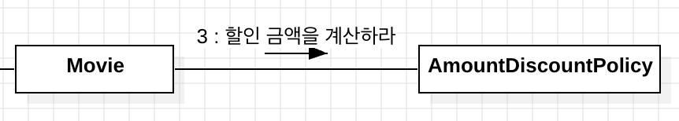
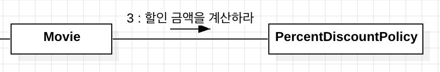

이번 장은 전반적으로 앞에서 설명했던 내용들의 연장선 느낌이었다.

강조해서 반복하는 부분들이 많아서 그런지 읽으면서 살짝 루즈해지긴 했지만, 객체를 설계함에 있어서 `협력에 집중해야 한다`는 점을 그만큼 확실히 각인할 수 있었다.

# 1. 협력을 먼저 설계해야 올바른 객체를 설계할 수 있다.

객체를 설계하는 과정에 대해 항상 의문이 들었는데, 이번 장을 통해서 올바른 객체 설계 과정을 이해할 수 있었다.

객체지향은 **객체끼리 협력하는 공동체**를 만드는 것이다. 즉, 객체지향은 주어진 문제를 협력으로 해결하는 방법으로 볼 수 있다.

따라서, 좋은 객체지향을 설계하려면 `문제를 해결하는 과정에서 협력을 어떻게 해야하는지`가 주가 되어야 한다.

# 2. 책임의 할당: 객체가 메시지를 결정하는 것 ❌ 메시지가 객체를 결정하는 것 ✅

적절한 책임을 할당하는 방법은, 해당 **책임을 수행하는데 필요한 정보를 가장 잘 알고 있는 객체에게** 할당하는 것이다.

> 👉🏻 즉, 각각의 협력(= 메시지)을 가장 잘 처리할 수 있는 객체를 선택해야 한다.

결국, 좋은 객체지향 설계는 **협력에 필요한 메시지를 찾고**, **메시지에 적합한 객체를 선택하는 반복적인 과정**을 통해 이뤄진다.

> 👉🏻 이렇게 협력을 먼저 설계하여 메시지를 결정한 후, 메시지에 적합한 객체를 선택하는 과정을 반복한다면, 각 객체에는 `필요한 최소한의 인터페이스만 포함`하도록 설계할 수 있다.

# 3. 협력 과정에서는 협력의 주체를 객체가 아닌 역할로

협력을 설계할 때는 협력의 주체를 객체가 아닌 역할로 설정해야 한다.

`영화 예매 서비스` 예시를 보면 이 부분에 대한 이해를 더 쉽게 할 수 있다.  
영화 예매 서비스에는 크게 두 가지 할인 정책이 존재한다.

- `AmountDiscountPolicy` (= 금액 할인 정책)
- `PercentDiscountPolicy` (= 비율 할인 정책)

이는 객체로 협력을 설계한 것이다.  
이처럼 역할이 아닌 객체를 기반으로 협력을 설계하면 다음과 같은 협력들이 설계될 것이다.

하지만 객체가 아닌 역할로 협력을 설계하면 다음과 같은 협력이 설계된다.

> 👉🏻 즉, 객체가 아닌 **역할로 협력을 설계**하면 객체를 더 **일반화** 할 수 있으며, 이는 `추상화`로 연결된다.
