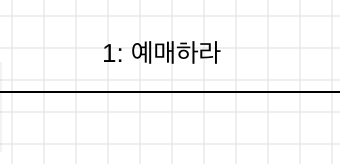
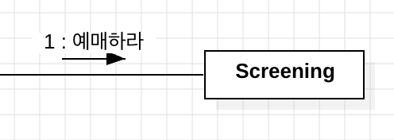
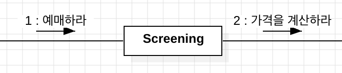
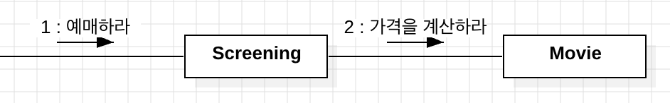

# Chapter 03: 역할, 책임, 협력

객체지향 패러다임 관점에서 핵심은 `역할`, `책임`, `협력`이다.  
클래스, 상속, 지연 바인딩도 중요하지만, 다분히 구현 측면에 치우쳐 있으므로 객체지향 패러다임의 본질과는 거리가 멀다.

객체지향의 본질은 협력하는 `객체들의 공동체를 창조하는 것`이다.  
애플리케이션 기능을 구현하기 위해 **어떤 협력이 필요**하고 **협력을 위해 어떤 역할과 책임이 필요한지** 충분히 고민한 후 구현에 들어가야 한다.

## 1. 협력

### 영화 예매 시스템 돌아보기

앞 장의 예제를 살펴보면, 다양한 객체들이 **영화 예매라는 기능**을 구현하기 위해 **`메시지`를 주고받으면서 상호작용하고 있음**을 확인할 수 있다.

> 이처럼 애플리케이션의 **기능을 구현하기 위해 수행하는 상호작용**을 `협력`이라 한다.  
> 객체가 **협력에 참여하기 위해 수행하는 로직**은 `책임`이라고 한다.  
> 객체들이 협력 안에서 수행하는 책임들이 모여, 객체가 수행하는 `역할`을 구성한다.

### 협력

**메시지 전송**은 객체 사이의 협력을 위해 사용할 수 있는 유일한 커뮤니케이션 수단이다.  
👉🏻 즉, 객체는 다른 객체에게 **오직 메시지 전송을 통해서만 자신의 요청을 전달**할 수 있다.

> `Screening`이 `Movie`에게 처리를 위임하는 이유는 **요금을 계산하는 데 필요한 기본 요금과 할인 정책을 가장 잘 아는 객체**가 `Movie`이기 때문이다.

각 객체는 자율적인 존재로서, **자신이 알고 있는 정보**를 이용해 직접 **요청에 대한 책임**을 수행해야 한다.

- 그리고 이렇게 객체를 자율적으로 만드는 기본적인 방법은, 내부 구현을 `캡슐화` 하는 것이다.

이처럼 `자율적인 객체`는 **책임을 수행하는 과정**에서, 필요한 정보를 알지 못하거나 외부의 도움이 필요한 경우 **적절한 객체에게 `메시지`를 전송해서 `협력`을 요청**한다.

### ⭐️ 협력이 설계를 위한 문맥을 결정한다.

그렇다면, 객체가 가질 수 있는 `상태`와 `행동`을 어떤 기준으로 결정해야 할까?  
객체를 설계할 때 어떤 행동과 상태를 할당했다면, 그 이유는 무엇일까?

> 👉🏻 `객체의 행동`을 결정하는 것은 객체가 참여하고 있는 `협력`이다.

즉, **협력**은 **객체가 필요한 이유**와 **객체가 수행하는 행동의 동기**를 제공한다.

```md
[ Movie 객체의 행동 돌아보기 ]

영화라는 단어를 들으면, 대부분 극장에서 영화를 상영하는 장면을 상상할 것이고, Movie 객체가 play 라는 행동을 수행할 것이라 생각한다.

하지만 `영화 예매 시스템` 안의 Movie는 "요금을 계산하는 행동과 관련된 것만" 포함된다.

👉🏻 이것은 Movie가 영화를 예매하기 위한 `협력`에 참여하고 있고, 그 안에서 요금을 계산하는 `책임`을 지고 있기 때문이다.
```

따라서 객체의 행동과 상태는 아래와 같이 결정된다고 볼 수 있다.

- **객체의 행동**
  - 객체의 행동을 결정하는 것은 `협력`이다.
- **객체의 상태**
  - 객체가 `행동을 수행하는 데 필요한 정보`가 무엇인지로 결정된다.

---

## 2. 책임

### 책임이란 무엇인가

객체를 설계하기 위해 필요한 문맥인 협력이 갖춰졌다고 하자.  
다음으로 할 일은 **협력에 필요한 행동을 수행할 수 있는** 적절한 객체를 찾는 것이다.

> 👉🏻 이때, **협력에 참여하기 위해** 객체가 수행하는 행동을 `책임`이라고 부른다.

책임은 아래 두 가지 항목으로 구성된다.

- 객체가 **무엇을 알고 있는가?** _(doing)_
  - 사적인 정보에 관해 아는 것
  - 관련된 객체에 관해 아는 것
  - 자신이 유도하거나 계산할 수 있는 것에 관해 아는 것
- 객체가 **무엇을 할 수 있는가?** _(knowing)_
  - 객체를 생성하거나 계산을 수행하는 등의 스스로 하는 것
  - 다른 객체의 행동을 시작시키는 것
  - 다른 객체의 활동을 제어하고 조절하는 것

```md
[ Screening ]

하는 것 - `영화를 예매`할 수 있어야 한다.
아는 것 - `자신이 상영할 영화`를 알고 있어야 한다.
```

👉🏻 결국 **적절한 협력이 적절한 책임을** 제공하고, **적절한 책임을 적절한 객체에게** 할당해야 단순하고 유연한 설계를 창조할 수 있다.

### 책임 할당

자율적인 객체를 만드는 가장 기본적인 방법은, 책임을 수행하는 데 **필요한 정보를 가장 잘 알고 있는 `전문가`에게** 그 책임을 할당하는 것이다.

```
객체지향의 설계는 시스템의 책임을 완료하는 데 필요한 더 작은 책임을 찾아내고, 이를 객체들에게 할당하는 반복적인 과정을 통해 모영을 갖춰간다.
```

#### 영화 예매 시스템: 전문가에게 책임을 할당하기

시스템이 사용자에게 제공해야 할 기능은 영화를 예매하는 것이고, 이 기능을 시스템이 제공할 책임으로 할당할 것이다.

따라서, _예매하라_ 라는 이름의 메시지로 협력을 시작한다.



메시지를 선택했으면, 메시지를 처리할 적절한 객체를 선택해야 한다.  
`예매하는 책임`은 **영화 예매와 관련된 정보를 가장 많이 알고 있는 객체에게** 책임을 할당하는 것이 바람직하다.

> 👉🏻 영화 예매를 위해서는 `상영 시간`과 `기본 요금`을 알아야 한다. 따라서, 이 정보를 소유하거나 소유자를 가장 잘 알고 있는 `Screening`에게 책임을 할당한다.



이제 영화를 예매하기 위해서는 **예매 가격을 계산해야** 한다.  
하지만 `Screening`은 예매 가격을 계산하는 데 필요한 정보를 충분히 알지 못한다.  
즉, 외부 객체에게 가격 계산을 요쳥해야 한다.

여기서 필요한 새로운 메시지는 _가격을 계산하라_ 이다.



> 👉🏻 마찬가지로 이 메시지를 수신하기에 적절한 객체는, **가격 계산에 필요한 정보(= `가격`, `할인 정책`)를 가장 많이 알고있는** `Movie` 객체가 된다.



```md
[ 객체보다 메시지를 먼저 ]

이처럼 객체지향 설계는 `협력에 필요한 메시지`를 찾고, `메시지에 적절한 객체`를 선택하는 반복적인 과정을 통해 이뤄진다.
```

### 책임 주도 설계

지금까지 설명의 요점은 협력을 설계하기 위해서는 **책임에 초점을 맞춰야 한다**는 것이다.

> **책임 주도 설계**  
> 책임을 찾고 책임을 수행할 적절한 객체를 찾아 책임을 할당하는 방식으로 협력을 설계하는 방법

```
[ 책임 주도 설계 과정 ]

1. 시스템이 사용자에게 제공해야 하는 기능인 시스템 책임을 파악한다.
    - 영화 예매하기

2. 시스템 책임을 더 작은 책임으로 분할한다.
    - 영화 예매하기 👉🏻 가격 계산하기 👉🏻 할인가 계산하기 👉🏻 정책 적용 여부 결정하기 ...

3. 분할된 책임을 수행할 수 있는 적절한 객체 또는 역할을 찾아 책임을 할당한다.
    - 영화 예매하기: Screening, 가격 계산하기: Movie ...

4. 객체가 책임을 수행하는 도중 다른 객체의 도움이 필요한 경우, 이를 책임질 적절한 객체 또는 역할을 찾는다.
    - Screening 👉🏻 Movie 👉🏻 DiscountPolicy

5. 해당 객체 또는 역할에게 책임을 할당ㅎㅁ으로써 두 객체가 협력하게 한다.
```

⭐️ `협력`이 `책임`을 이끌고, 책임이 협력에 참여할 `객체`를 결정한다.

책임을 할당할 때 고려해야 하는 두 가지 요소는 다음과 같다.

1. 메시지가 객체를 결정한다.
2. 행동이 상태를 결정한다.

### 메시지가 객체를 결정한다.

> 👉🏻 객체에게 책임을 할당하는 데 필요한 `메시지`를 먼저 식별하고, `메시지를 처리할 객체`를 나중에 선택했다는 것이 중요하다.

⭐️ 즉, 객체가 메시지를 선택한 것이 아니라 `메시지가 객체를 선택한다.`

- **최소한의 인터페이스**
  - 메시지로 객체를 결정하면, `애플리케이션에 필요한 최소한의` 인터페이스를 가질 수 있다.
- **추상적인 인터페이스**
  - 메시지를 먼저 식별하면 `무엇을 수행할지(what)`에 초점을 맞추는 인터페이스를 얻을 수 있다.

### 행동이 상태를 결정한다.

상태는 **행동을 결정하고 나서야** 결정할 수 있다.

- 상태는 객체가 행동하는 데 필요한 것들이기 때문

---

## 3. 역할

어떤 특정한 협력 안에서 수행하는 **책임의 집합**을 역할이라고 한다.

```
[ 책임 할당 과정 ]

1. 역할 찾기
   - 영화를 예매할 수 있는 적절한 역할이 무엇인가를 찾기

2. 역할을 수행할 주체 고르기
   - 역할을 수행할 객체로 Screening 인스턴스를 선택
```

### 유연하고 재사용 가능한 협력

역할이 중요한 이유는 역할을 통해 `유연하고 재사용 가능한 협력`을 얻을 수 있기 때문이다.

문제를 해결하기 위해서는 객체가 아닌 `책임`에 초점을 맞춰야 한다.

> **객체 관점** - 금액 할인(`AmountDiscountPolicy`)와 비율 할인(`PercentDiscountPolicy` )  
> **책임 관점** - 요금 할인(`DiscountPolicy`)

즉, 역할을 통해서 **객체를 일반화** 할 수 있다. 👉🏻 `추상화`로 연결 가능

### 역할과 추상화

앞서 본 예시처럼, `역할`이 중요한 이유는 **동일한 협력을 수행하는 객체들**을 `추상화` 할 수 있기 때문이다.

### 객체 = 배우, 역할 = 배역

#### 배우가 배역을 맡는다 = 객체가 역할을 수행한다

객체는 `협력`이라는 실행 문맥 안에서 `특정한 역할을 수행`한다.

연극 배우는 연극이 끝나면 자신의 배역을 잊고 원래의 자기 자신을 되찾는다.  
마찬가지로 `객체`는 **협력이 끝나고**, 협력에서의 역할을 잊고 **원래의 객체로** 돌아올 수 있다.

```
[ 역할은 협력에 종속된다 ]

역할은 객체가 협력에 참여하는 잠시 동안에만 존재하는 일시적인 개념이다.
👉🏻 즉, 오직 시스템의 문맥 안에서 무엇을 하는지에 의해서만 정의될 수 있다.
```

#### 배역이 다른 배우로 교체될 수 있다 = 역할은 다른 객체로 교체될 수 있다

하나의 배역을 여러 배우가 연기할 수 있는 것처럼, **동일한 역할을 수행하는 하나 이상의 객체들이 존재**할 수 있다.
