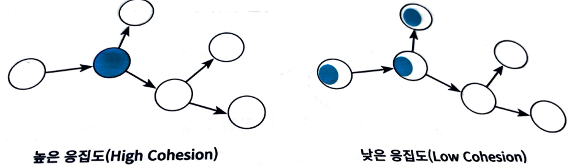
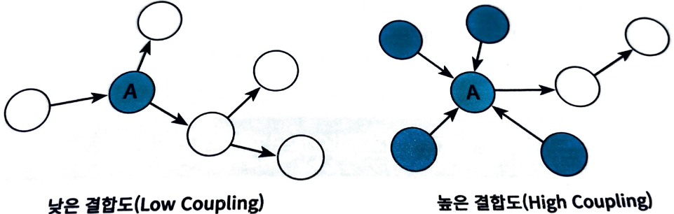

# Chapter 04: 설계 품질과 트레이드오프

객체지향 설계란 `올바른 객체에게 올바른 책임을 할당`하면서 **낮은 결합도**와 **높은 응집도**를 가진 구조를 창조하는 활동이다.

- 객체지향 설계의 핵심은 `책임`이다.
- 책임을 할당하는 작업이 `응집도`와 `결합도` 같은 **설계 품질과 깊이 연관**되어 있다.

> 👉🏻 결합도와 응집도를 합리적인 수준으로 유지할 수 있는 중요한 원칙은, **객체의 상태가 아닌 `객체의 행동`에 초점을 맞추는 것**이다.

`책임`은 객체의 상태에서 **행동**으로, 나아가 객체와 객체 사이의 **상호작용**으로 설계 중심을 이동시킨다.

---

## 1. 데이터 중심의 영화 예매 시스템

- `데이터 중심 관점`
  - 객체는 **자신이 포함하는 데이터**를 조작하는 데 필요한 오퍼레이션을 정의한다.
  - **객체의 상태**에 초점 _(-> "데이터가 무엇인가"를 묻는 것으로 시작)_
- `책임 중심 관점`
  - 객체는 **다른 객체가 요청할 수 있는 오퍼레이션**을 위해 필요한 상태를 보관한다.
  - **객체의 행동**에 초점 _(-> "책임이 무엇인가"를 묻는 것으로 시작)_

`객체의 상태`는 **구현**에 속한다. 구현은 불안정하기 때문에 **변하기 쉽다.**  
👉🏻 상태를 객체 분할의 중심축으로 삼으면, 구현에 관한 세부사항이 객체의 인터페이스에 스며들어 **캡슐화의 원칙이 무너진다.**

`객체의 책임`은 **인터페이스**에 속한다.  
👉🏻 객체는 책임을 드러내는 **안정적인 인터페이스** 뒤로 책임을 수행하는 데 필요한 **상태를 캡슐화**하여, 구현 변경에 대한 파장이 외부로 퍼지는 것을 방지한다.

### 데이터를 준비하자

먼저, `데이터 중심 설계`를 따르기 위해 `Movie`에 **저장될 데이터를 결정하는 것**으로 설계를 시작한다.

```java
public class Movie {
    private String title;
    private Duration runningTime;
    private Money fee;
    private List<DiscountCondition> discountConditions;

    private MovieType movieType;
    private Money discountAmount;
    private double discountPercent;
}
```

앞 장에서 살펴본 책임 중심 설계와의 가장 큰 차이점은 아래와 같다.

- 할인 조건 목록(`discountConditions`)이 인스턴스 변수로 포함되어 있다.
- 할인 정책(`DiscountPolicy`)을 할인 금액(`discountAmount`)과 할인 비율(`discountPercent`)로 나눠서 직접 정의하고 있다.

#### 할인 정책

할인 정책은 영화별(= `MovieType`)로 오직 하나만 지정 가능하다.  
그렇기 때문에, 한 시점에 `discountAmount`와 `discountPercent` 중 하나의 값만 사용될 수 있다.

두 할인 정책 중에서 어느 것을 적용할 것인지는 `MovieType`에 달려있다.

```java
public enum MovieType {
    AMOUNT_DISCOUNT,    // 금액 할인 정책
    PERCENT_DISCOUNT,   // 비율 할인 정책
    NONE_DISCOUNT,      // 미적용
    ;
}
```

> **데이터 중심 접근 방법**  
> 할인 금액을 계산하는 데 필요한 데이터 👉🏻 `discountAmount`_(금액 할인)_, `discountPercent`_(비율 할인)_  
> 할인 정책을 결정하는 데 필요한 데이터 👉🏻 `MovieType`_(할인 정책)_

이처럼 데이터 중심 설계에서는 `객체가 포함해야 하는 데이터`에 집중한다.

```
" 이 객체가 포함해야 하는 데이터는 무엇인가? "

객체의 책임을 결정하기 전에 이런 질문의 반복에 휩쓸려 있다면, 데이터 중심 설계에 매몰돼 있을 확률이 높다.
```

#### Movie 클래스 정의

이렇게 데이터 중심 설계 과정 이후에, **접근자(accessor)** 와 **수정자(mutator)** 를 추가하여 `Movie` 클래스를 정의하면 다음과 같다.

```java
public class Movie {
    private String title;
    private Duration runningTime;
    private Money fee;
    private List<DiscountCondition> discountConditions;

    private MovieType movieType;
    private Money discountAmount;
    private double discountPercent;

    public MovieType getMovieType() {
        return movieType;
    }

    public Money getFee() {
        return fee;
    }

    public void setFee(Money fee) {
        this.fee = fee;
    }

    public List<DiscountCondition> getDiscountConditions() {
        return Collections.unmodifiableList(discountConditions);
    }

    public void setDiscountConditions(List<DiscountCondition> discountConditions) {
        this.discountConditions = discountCOnditions;
    }

    public Money getDiscountAmount() {
        return discountAmount;
    }

    public void setDiscountAmount(Money discountAmount) {
        this.discountAmount = discountAmount;
    }

    public double getDiscountPercent() {
        return discountPercent;
    }

    public void setDiscountPercent(double discountPercent) {
        this.discountPercent = discountPercent;
    }
}
```

#### DiscountCondition 클래스 정의

할인 조건은 다음과 같다.

- **순번 조건**
  - `상영 순번`을 이용
- **기간 조건**
  - `상영 기간`을 이용

데이터 중심 설계에서 할인 조건을 설계하기 위해 해야하는 질문은 다음과 같다.

- **할인 조건을 구현하는 데 필요한 데이터**는 무엇인가?
  - `할인 조건의 종류`를 저장할 데이터가 필요하다.

```java
public enum DiscountConditionType {
    SEQUENCE,   // 순번 조건
    PERIOD,     // 기간 조건
    ;
}
```

할인 조건을 구현하는 `DiscountCondition`은 할인 조건의 타입을 저장할 인스턴스 변수인 `type`을 포함한다. 그리고 각 조건에서 사용되는 데이터를 모두 포함해야 한다.

- 순번 조건에서만 사용되는 데이터
  - 상영 순번(`sequence`)
- 기간 조건에서만 사용되는 데이터
  - 요일(`dayOfWeek`), 시작 시간(`startTime`), 종료 시간(`endTime`)

```java
public class DiscountCondition {
    private DiscountConditionType type;

    private int sequence;

    private DayOfWeek dayOfWeek;
    private LocalTime startTime;
    private LocalTime endTime;
}
```

앞서 `Movie`와 마찬가지로 접근자와 수정자로 메소드를 정의할 수 있다. 코드는 생략한다.

> 👉🏻 여기서 드는 의문점은, 객체의 모든 필드에 대해서 `setter`, `getter`를 설정하는 것이 **과연 캡슐화라고 할 수 있는 것인가**다.

#### Screening 클래스 정의

앞선 과정과 비슷하게 진행되며, 정리 과정에서 코드는 생략한다.

#### Reservation 클래스 정의

앞선 과정과 비슷하게 진행되며, 정리 과정에서 코드는 생략한다.

#### Customer 클래스 정의

앞선 과정과 비슷하게 진행되며, 정리 과정에서 코드는 생략한다.

### 영화를 예매하자

데이터 클래스들을 조합해서 영화 예매 절차를 구현하는 `ReservationAgency` 클래스를 정의한다.

```java
public class ReservationAgency {
    public Reservation reserve(Screening screening, Customer customer, int audienceCount) {
        Movie movie = screening.getMovie();

        boolean discountable = false;
        for (DiscountCondition condition : movie.getDiscountConditions()) {
            if (condition.getType() == DiscountConditionType.PERIOD) {
                discountable = screening.getWhenScreened().getDayOfWeek().equals(condition.getDayOfWeek())
                && condition.getStartTime().compareTo(screening.getWhenScreened().toLocalTime()) <= 0
                && condition.getEndTime().compareTo(screening.getWhenScreened().toLocalTime()) >= 0;
            } else {
                discountable = condition.getSequence() == screening.getSequence();
            }

            if (discountable) {
                break;
            }
        }

        Money fee;
        if (discountable) {
            Money discountAmount = Money.ZERO;
            switch (movie.getMovieType()) {
                case AMOUNT_DISCOUNT:
                    discountAmount = movie.getDiscountAmount();
                    break;
                case PERCENT_DISCOUNT:
                    discountAmount = movie.getFee().times(movie.getDiscountPercent());
                    break;
                case NONE_DISCOUNT:
                    discountAmount = Money.ZERO;
                    break;
            }

            fee = movie.getFee().minus(discountAmount);
        } else {
            fee = movie.getFee();
        }

        return new Reservation(customer, screening, fee, audienceCount);
    }
}
```

이 설계를 책임 중심 설계 방법과 비교해서 두 방식의 장단점을 파악한다.

---

## 2. 설계 트레이드오프

두 방식을 비교하기 위해 `캡슐화`, `응집도`, `결합도`를 살펴본다.

### 캡슐화

`상태`와 `행동`을 하나의 객체 안에 모으는 이유는 **객체의 내부 구현을 외부로부터 감추기 위해서**다.

```
여기서 말하는 "구현"은 나중에 변경될 가능성이 높은 어떤 것을 의미한다.
```

- **구현**
  - 변경될 가능성이 높은 부분
- **인터페이스**

  - 상대적으로 안정적인 부분

  > 👉🏻 `구현`은 내부에 숨기고, 외부에는 `인터페이스`만 공개함으로써 변경의 여파를 통제할 수 있다.
  >
  > 👉🏻 객체를 설계하는 가장 기본적인 아이디어는 **변경의 정도에 따라** `구현`과 `인터페이스`를 분리하고, 외부에서는 `인터페이스`에만 의존하도록 관계를 조절하는 것이다.

```
[ 객체 내부에 어떤 것을 캡슐화 해야하는가? ]

👉🏻 변경될 수 있는 어떤 것이라도 캡슐화해야 한다.
```

### 응집도와 결합도

응집도와 결합도는 `변경`과 관련된 것이다.

- **응집도**
  - 모듈에 포함된 **내부 요소들이 연관되어 있는 정도**
  - **하나의 목적**을 위해 긴밀하게 협력한다면, 그 모듈은 `높은 응집도`를 가짐
  - 모듈 내의 요소들이 **서로 다른 목적을 추구**한다면, 그 모듈은 `낮은 응집도`를 가짐
  - 객체/클래스에 **얼마나 관련 높은 책임들을 할당했는지** 나타냄
- **결합도**
  - `의존성`의 정도
  - **다른 모듈에 대해 얼마나 많은 지식을 갖고 있는지** 나타냄
  - 어떤 모듈이 **다른 모듈에 대해 너무 자세한 부분까지 알고 있다**면, 두 모듈은 `높은 결합도`를 가짐
  - 어떤 모듈이 다른 모듈에 대해 **꼭 필요한 지식만** 알고 있다면, 두 모듈은 `낮은 결합도`를 가짐
  - 객체/클래스가 **협력에 필요한 적절한 수준의 관계만을 유지**하고 있는지 나타냄

좋은 설계란 오늘의 기능을 수행하면서 내일의 변경을 수용할 수 있는 설계다.

`높은 응집도`와 `낮은 결합도`를 추구해야 하는 이유는 **설계를 변경하기 쉽게 만들기** 때문이다.

#### 응집도 측정하기

> 변경이 발생할 때 모듈 내부에서 발생하는 변경의 정도로 측정할 수 있다.

- `높은 응집도`
  - 하나의 변경을 수용하기 위해, **모듈 전체가 함께 변경**되는 경우
  - 하나의 변경을 수용하기 위해, **하나의 모듈만 변경**되는 경우
- `낮은 응집도`
  - 하나의 변경을 수용하기 위해, **모듈의 일부만 변경**되는 경우
  - 하나의 변경을 수용하기 위해, **다수의 모듈이 함께 변경**되어야 하는 경우

아래 그림을 보면, `응집도가 높은 설계`에서는 하나의 요구사항 변경을 반영하기 위해 오직 하나의 모듈만 수정하면 된다.

`응집도가 낮은 설계`에서는 하나의 원인에 의해 변경해야 하는 부분이 다수의 모듈에 분산되어 있어서, 여러 모듈을 동시에 수정해야 한다.



> 음영으로 칠해진 부분은 변경이 발생했을 때 수정되는 영역을 표현한 것

즉, 응집도가 높을수록 **변경을 반영하기 위해 오직 하나의 모듈만 수정**하면 된다. _(코드 구석구석 헤매고 다니거나, 여러 모듈을 동시에 수정할 필요가 없음)_

#### 결합도 측정하기

> 한 모듈이 변경되기 위해서 다른 모듈의 변경을 요구하는 정도로 측정할 수 있다.  
> _= 하나의 모듈을 수정할 때 얼마나 많은 모듈을 함께 수정해야 하는지_

- **낮은 결합도**
  - 변경해야 하는 모듈의 수가 매우 적다. (하나만 수정)
- **높은 결합도**
  - 함께 변경해야 하는 모듈의 수가 늘어난다.



`낮은 결합도`를 가진 왼쪽 설계에서는 모듈 A를 변경했을 때 **하나의 모듈만 영향**을 받는다.

`높은 결합도`를 가진 오른쪽 설계에서는 모듈 A를 변경했을 때 **4개의 모듈을 동시에** 변경해야 한다.

👉🏻 클래스의 구현이 아닌 `인터페이스`에 의존하도록 코드를 작성해야 `낮은 결합도`를 얻을 수 있다.

```
[ 캡슐화의 중요성 ]

결국 캡슐화의 정도가 응집도와 결합도에 영향을 미친다.
캡슐화를 지키면 모듈 안의 응집도는 높아지고, 모듈 사이의 결합도는 낮아진다.

👉🏻 응집도와 결합도를 고려하기 전에, 먼저 캡슐화를 향상시키기 위해 노력하라
```

---

## 3. 데이터 중심의 영화 예매 시스템의 문제점

1. 캡슐화 위반
2. 높은 결합도
3. 낮은 응집도

### 1. 캡슐화 위반

`접근자`와 `수정자` 메서드는 객체 내부의 상태에 대한 **어떤 정보도 캡슐화하지 못한다**.

```md
구현을 캡슐화할 수 있는 적절한 책임은 `협력`이라는 문맥을 고려할 때만 얻을 수 있다.
```

앞의 예시처럼, **설계 과정에서 `협력`에 관해 고민하지 않으면** 캡슐화를 위반하는 과도한 접근자와 수정자를 가지게 되는 경향이 있다.

- 이처럼, **객체가 사용될 문맥을 추측할 수밖에 없는 경우**, 개발자는 어떤 상황에서도 해당 객체가 사용될 수 있게 최대한 많은 접근자 메서드를 추가하게 되는 것이다. _(= 추측에 의한 설계 전략)_

### 2. 높은 결합도

객체 내부의 구현이 객체의 인터페이스에 드러난다는 것은 클라이언트가 구현에 강하게 결합된다는 것을 의미한다.

특히, 대부분의 제어 로직을 갖는 `ReservationAgency`가 **모든 데이터 객체에 의존하는 것**을 알 수 있다.

- `DiscountCondition`의 데이터가 변경되면 `ReservationAgency`도 함께 수정해야 한다.
- `Screening`의 데이터가 변경되면 `ReservationAgency`도 함께 수정해야 한다.

👉🏻 시스템 안의 어떤 변경도 `ReservationAgency`의 변경을 유발한다.

### 3. 낮은 응집도

**서로 다른 이유로 변경되는 코드**가 하나의 모듈 안에 공존할 때, 모듈의 응집도가 낮다고 말한다.

다음과 같은 수정사항이 발생하는 경우, `ReservationAgency`의 코드를 수정해야 할 것이다.

- 할인 정책이 추가될 경우
- 할인 정책별로 할인 요금을 계산하는 방법이 변경될 경우
- 할인 조건이 추가되는 경우
- 할인 조건별로 할인 여부를 판단하는 방법이 변경될 경우
- 예매 요금을 계산하는 방법이 변경될 경우

낮은 응집도는 두 가지 측면에서 설계에 문제를 일으킨다.

1. **변경과 아무런 상관이 없는 코드들이 영향을 받는다.**

   `ReservationAgency` 안에 할인 정책을 선택하는 코드와 할인 조건을 판단하는 코드가 함께 존재함  
   👉🏻 할인 정책을 추가하는 작업이 할인 조건에도 영향을 미칠 수 있음

2. **하나의 요구사항 변경을 반영하기 위해, 동시에 여러 모듈을 수정해야 한다.**

   ```
   [ 단일 책임 원칙(SRP) ]

   - 클래스의 응집도를 높일 수 있는 설계 원칙

   👉🏻 클래스는 단 한 가지의 변경 이유만 가져야 한다.
   👉🏻 여기서 말하는 '책임'은 "변경의 이유"라는 의미로 사용된다.
   ```

---

## 4. 자율적인 객체를 향해

객체에게 **의미있는 메서드**는 객체가 책임져야 하는 무언가를 수행하는 메서드다.

**자신의 상태**를 변경하는 주체를 외부 객체가 아닌 `자신에게`로 이동시켜야 한다.

### 스스로 자신의 데이터를 책임지는 객체

객체는 단순한 데이터 제공자가 아니다.  
👉🏻 객체 내부에 저장되는 데이터보다, 객체가 `협력`에 참여하면서 수행할 **책임을 정의하는 `오퍼레이션`** 이 더 중요하다.

따라서, 현재의 문제점을 개선하기 위해서는 _"이 객체가 어떤 데이터를 포함해야 하는가?"_ 라는 질문은 다음과 같은 두 개의 개별적인 질문으로 분리해야 한다.

- 이 객체가 어떤 데이터를 포함해야 하는가?
- 이 객체가 데이터에 대해 수행해야 하는 오퍼레이션은 무엇인가?

#### `DiscountCondition` 클래스

어떤 데이터를 포함해야 할 것인지는 앞서 결정했다.

```java
public class DiscountCondition {
    private DiscountConditionType type;

    private int sequence;

    private DayOfWeek dayOfWeek;
    private LocalTime startTime;
    private LocalTime endTime;
}
```

따라서, 이 데이터에 대해 수행 가능한 오퍼레이션이 무엇인가를 물어보면 된다.

할인 조건에는 두 가지 종류가 존재하며, 각 조건에 따라서 할인 여부 결정 과정이 다르다.

- **순번 조건**
  - `sequence`
- **기간 조건**
  - `dayOfWeek`, `startTime`, `endTime`

따라서 객체 외부에서 두 가지 할인 조건을 판단할 수 있도록 `isDiscountable` 메서드를 정의한다.

````java
```java
public class DiscountCondition {
    // ...

    public DiscountConditionType getType() {
        return type;
    }

    public boolean isDiscountable(DayOfWeek dayOfWeek, LocalTime time) {
        if (type != DiscountConditionType.PERIOD) {
            throw new IllegalArgumentException();
        }

        return this.dayOfWeek.equals(dayOfWeek)
                && this.startTime.compareTo(time) <= 0
                && this.endTime.compareTo(time) >= 0;
    }

    public boolean isDiscountable(int sequence) {
        if (type != DiscountConditionType.SEQUENCE) {
            throw new IllegalArgumentException();
        }

        return this.sequence == sequence;
    }
}
````

#### `Movie` 클래스

어떤 데이터를 포함해야 할 것인지는 앞서 결정했다.

```java
public class Movie {
    private String title;
    private Duration runningTime;
    private Money fee;
    private List<DiscountCondition> discountConditions;

    private MovieType movieType;
    private Money discountAmount;
    private double discountPercent;
}
```

`Movie`가 포함하는 데이터를 살펴보면, 영화 요금을 계산하는 오퍼레이션과 할인 여부를 판단하는 오퍼레이션이 필요할 것 같다.

```java
public class Movie {
    // ...

    public MovieType getMovieType() {
        return movieType;
    }

    public Money calculateAmountDiscountedFee() {
        if (movieType != MovieType.AMOUNT_DISCOUNT) {
            throw new IllegalArgumentException();
        }

        return fee.minus(discountAmount);
    }

    public Money calculatePercentDiscountFee() {
        if (movieType != MovieType.PERCENT_DISCOUNT) {
            throw new IllegalArgumentException();
        }

        return fee.minus(fee.times(discountPercent));
    }

    public Money calculateNoneDiscountedFee() {
        if (movieType != MovieType.NONE_DISCOUNT) {
            throw new IllegalArgumentException();
        }

        return fee;
    }

    public boolean isDiscountable(LocalDateTime whenScreened, int sequence) {
        for (DiscountCondition condition : discountConditions) {
            if (condition.getType() == DiscountConditionType.PERIOD) {
                if (condition.isDiscountable(whenScreened.getDayOfWeek(), whenScreened.toLocalTime())) {
                    return true;
                }
            } else {
                if (condition.isDiscountable(sequence)) {
                    return true;
                }
            }
        }

        return false;
    }
}
```

#### `Screening` 클래스

```java
public class Screening {
    private Movie movie;
    private int sequence;
    private LocalDateTime whenScreened;

    // ...

    public Money calculateFee(int audienceCount) {
        switch (movie.getMovieType()) {
            case AMOUNT_DISCOUNT:
                if (movie.isDiscountable(whenScreened, sequence)) {
                    return movie.calculateAmountDiscountedFee().times(audienceCount);
                }
                break;
            case PERCENT_DISCOUNT:
                if (movie.isDiscountable(whenScreened, sequence)) {
                    return movie.calculatePercentDiscountedFee().times(audienceCount);
                }
                break;
            case NONE_DISCOUNT:
                return return movie.calculateNoneDiscountedFee().times(audienceCount);
        }

        return movie.calculateNoneDiscountedFee().times(audienceCount);
    }
}
```

#### `ReservationAgency` 클래스

```java
public class ReservationAgency {
    public Reservation reserve(Screening screening, Customer customer, int audienceCount) {
        Money fee = screening.calculateFee(audienceCount);
        return new Reservation(customer, screening, fee, audienceCount);
    }
}
```

이 설계에서는 `데이터를 처리하는 데 필요한 메서드`를 데이터를 가지고 있는 **객체 스스로 구현**하고 있다. 따라서 이 객체들은 **스스로를 책임진다**고 말할 수 있다.

---

## 5. 하지만 여전히 부족하다

캡슐화 관점에서 두 번째 설계가 첫 번째보다 나은 것은 사실이지만, 만족스러울 정도는 아니다.

첫 번째 설계의 문제가 두 번째 설계에서도 여전히 발생하기 때문이다.

### 캡슐화 위반

`DiscountCondition`의 `isDiscountable` 메서드 시그니처는 아래와 같다.

```java
public boolean isDiscountable(DayOfWeek dayOfWeek, LocalTime time)

public boolean isDiscountable(int sequence)
```

> 👉🏻 이 메서드는 객체 내부에 **`DayOfWeek` 타입과 `LocalTime` 타입과 `int` 타입의 상태가 포함되어 있다는 사실**을 **인터페이스를 통해 노출하고 있는 것**이다.

즉, **상태의 타입이 변경**되는 순간 **인터페이스도 함께 변경**되는 `파급 효과`가 발생하는 것을 확인할 수 있다.

`Movie` 클래스 또한 마찬가지이다.

```java
public Money calculateAmountDiscountedFee()
public Money calculatePercentDiscountedFee()
public Money calculateNoneDiscountedFee()
```

> 👉🏻 인터페이스인 `함수명`을 통해서, **할인 정책이 구체적으로 무엇인지**를 외부에 노출시키고 있다.

마찬가지로 **새로운 정책이 추가되거나 제거**될 경우, **이 메서드들에 의존하는 모든 클라이언트가 영향**을 받게 된다.

```md
[ 캡슐화의 진정한 의미 ]

위의 예제에서 볼 수 있듯이, 캡슐화는 단순히 객체 내부의 데이터를 외부로부터 감추는 것 이상의 의미를 가진다.

👉🏻 캡슐화는 `변경될 수 있는 어떤 것이라도 감추는 것`을 의미한다.

따라서, 설계에서 변하는 것이 무엇인지 고려하고, 변하는 개념을 캡슐화해야 한다.
```

### 높은 결합도

> 구현의 변경이 다른 객체의 변경을 초래하는 것

앞서 살펴봤듯이, 캡슐화 위반으로 인해 `DiscountCondition`의 내부 구현이 외부로 노출됐기 때문에 `Movie`와 `DiscountCondition` 사이의 결합도는 높을 수밖에 없다.

- `DiscountCondition`의 기간 할인 조건의 명칭이 `PERIOD`에서 다른 값으로 변경된다면, **`Movie`를 수정해야 한다.**
- `DiscountCondition`의 종류가 추가되거나 삭제된다면 **`Movie` 안의 if ~ else 구문을 수정해야 한다.**
- 각 `DiscountCondition`의 만족 여부를 판단하는 데 필요한 정보가 변경되면, **`Movie`의 `isDiscountable` 메서드의 파라미터를 변경해야 한다.**

> 👉🏻 `DiscountCondition` **구현의 변경**이 다른 객체의 변경을 유발시키고 있다.

### 낮은 응집도

> 하나의 변경사항이 여러 모듈에 영향을 미치는 것

_(앞의 마지막 예제)_ - `DiscountCondition`이 **할인 여부를 판단하는 데 필요한 정보**가 변경되면, `Movie`의 `isDiscountable` 메서드로 전달해야 하는 파라미터 종류를 변경해야 한다.

그리고 `Screening` 클래스의 `calculateFee` 메서드에서도 `Movie`의 `isDiscountable` 메서드를 사용하기 때문에, `Screening` 클래스에서도 변경이 발생한다.

```md
즉, 할인 가능 여부를 판단하는 isDiscountable에 의존하는 객체가 `분산되어 존재`할뿐만 아니라(= 낮은 응집도), isDiscountable이 변화에 취약한 `상태`를 포함하고 있기 때문(= 캡슐화 위반)이다.
```

👉🏻 이는 원래` DiscountCondition`이나 `Movie`에 위치해야 하는 로직이 Screening으로 새어나왔기 때문이다.

---

## 6. 데이터 중심 설계의 문제점

1. 데이터 중심 설계는 본질적으로 **너무 이른 시기에 데이터에 관해 결정**하도록 강요한다.
2. 데이터 중심의 설계에서는 **협력이라는 문맥을 고려하지 않고** 객체를 고립시킨 채 오퍼레이션을 결정한다.

### 데이터 중심 설계는 행동보다는 상태에 초점을 맞춘다

데이터를 먼저 결정하고 데이터를 처리하는 데 필요한 오퍼레이션을 나중에 결정하는 방식은, `데이터에 관한 지식`이 객체의 `인터페이스`에 고스란히 드러나게 된다.

- 특히 이번 장에서 살펴봤듯이, 데이터 중심 설계를 **아무리 개선한다고 하더라도** 외부에 상태 노출을 피할 수 없기도 했다.

### 데이터 중심 설계는 객체를 고립시킨 채 오퍼레이션을 정의하도록 만든다

`올바른 객체지향 설계의 무게 중심`은 항상 객체의 내부가 아니라 `외부`에 맞춰져 있어야 한다.

**⭐️ 객체가 내부에 어떤 상태를 가지고 그 상태를 어떻게 관리하는가는 부가적인 문제다.**
