# Chapter 05: 책임 할당하기

`GRASP` 패턴은 책임 할당의 어려움을 해결하기 위한 답을 제시한다.  
이 패턴을 토대로 **응집도**와 **결합도**, **캡슐화** 같은 다양한 기준에 따라 책임을 할당하고, **결과를 트레이드오프 할 수 있는 기준**을 배우게 된다.

---

# 1. 책임 주도 설계를 향해

데이터 중심의 설계에서 `책임 중심의 설계`로 전환하기 위해서는 다음의 두 가지 원칙을 따라야 한다.

- 데이터보다 **행동**을 먼저 결정하라
- **협력이라는 문맥 안에서** 책임을 결정하라

## 데이터보다 행동을 먼저 결정하라

객체에게 중요한 것은 데이터가 아닌 외부에 제공하는 행동이다.  
책임 중심 설계에서는 **_"이 객체가 수행해야 하는 책임은 무엇인가"_** 를 결정한 후에 **_"이 책임을 수행하는 데 필요한 데이터는 무엇인가"_** 를 결정한다.

> 👉🏻 객체의 행동, 즉 `책임`을 먼저 결정한 후에 객체의 `상태`를 결정한다

## 협력이라는 문맥 안에서 책임을 결정하라

- 객체에게 할당된 책임이 **협력에 어울리지 않는다**면, 그 책임은 나쁜 것이다 ❌
- 객체 입장에서는 책임이 조금 어색해 보이더라도, **협력에 적합하다**면 그 책임은 좋은 것이다 ✅

> 👉🏻 책임은 객체의 입장이 아니라, 객체가 참여하는 `협력에 적합해야` 한다.  
> 협력에 적합한 책임이란, 메시지 수신자가 아닌 `메시지 전송자에게 적합한 책임`을 의미한다.

메시지를 전송하는 **클라이언트의 의도에 적합한 책임을 할당해야** 한다.

여기서 말하는 **_"협력에 적합한 책임"_** 을 수확하기 위해서는, 객체를 결정한 후 메시지를 선택하는 것이 아니라 **메시지를 결정한 후에 객체를 선택해야** 한다.

## 책임 주도 설계

3장에서 설명한 책임 주도 설계의 흐름이다.

1. 시스템이 사용자에게 제공해야 하는 기능인 `시스템 책임`을 파악한다.
2. 시스템 책임을 **더 작은 책임으로** `분할`한다.
3. 분할된 책임을 수행할 수 있는 **적절한 객체 또는 역할을 찾아** `책임을 할당`한다.
4. 객체가 책임을 수행하는 도중 **다른 객체의 도움이 필요한 경우**, 이를 책임질 적절한 객체 또는 역할을 찾는다.
5. 해당 객체 또는 역할에게 책임을 할당함으로써 두 객체가 협력하게 한다.

> ⭐️ 결국 핵심은 **책임을 결정한 후**에 **책임을 수행할 객체를 결정**하는 것이다.  
> 그리고 협력에 참여하는 객체들의 책임이 어느정도 정리될 때까지는, 객체의 내부 상태에 대해 관심을 가지지 않는 것이다.

---

# 2. 책임 할당을 위한 GRASP 패턴

## 도메인 개념에서 출발하기

어떤 책임을 할당해야 할 때, 가장 먼저 고민해야 하는 유력한 후보는 바로 `도메인` 개념이다.

하지만 여기서 유의할 점은, 설계를 시작하는 단계에서는 **개념들의 의미와 관계가 정확하거나 완벽할 필요가 없다**는 것이다.

- 이 단계에서는 `책임을 할당받을 객체들의 종류`와 `관계`에 대한 **유용한 정보**를 제공할 수 있다면 충분하다.

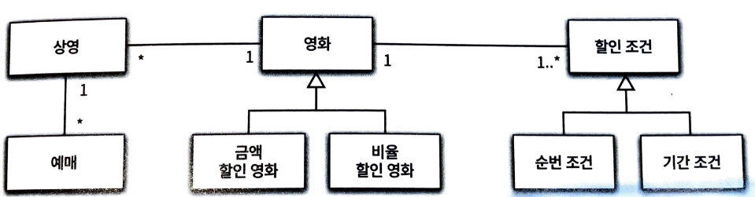

## 정보 전문가에게 책임을 할당하라

**_메시지를 수신할 적합한 객체는 누구인가?_** 라는 질문에 답하기 위해서는 `객체가 상태와 행동을 통합한 캡슐화의 단위`라는 사실에 집중해야 한다.

- 즉, **책임을 수행할 정보를 가장 잘 알고 있는 객체에게** 책임을 할당해야 한다. (= `INFORMATION EXPERT` 패턴)

⭐️ `INFORMATION EXPERT` 패턴에서 말하는 **"정보"** 는 데이터와 다르다는 사실에 주의해야 한다.

- 객체가 정보를 '**알고**' 있다고 해서 그 정보를 '**저장**'하고 있을 필요는 없다.
- 객체는 해당 정보를 제공할 수 있는 **다른 객체를 알고 있**거나 **필요한 정보를 계산해서 제공**할 수도 있다.

### `INFORMATION EXPERT` 패턴에 기반하여 책임 할당하기

#### 1. 예매하라

이 패턴에 따르면 예매하는 데 필요한 정보를 가장 많이 알고 있는 객체에게 **_예매하라_** 메시지를 처리할 책임을 할당해야 한다.

- `상영`은 **영화에 대한 정보**, **상영 시간**, **상영 순번**처럼 영화 예매에 필요한 다양한 정보를 알고 있다.

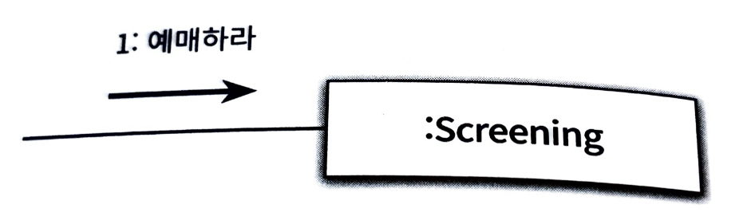

이제 외부의 인터페이스가 아닌, `Screening` 내부로 들어가 **메시지를 처리하기 위해 필요한 절차와 구현**을 고민해본다.

- `Screening`이 **책임을 수행하는 데 필요한 작업**을 구상해보고, `스스로 처리할 수 없는 작업이 무엇인지` 가릴 정도의 수준이면 된다.
  - 여기서 스스로 처리할 수 없는 작업은 다른 객체에게 책임을 할당한다.

#### 2. 가격을 계산하라

여기서 `Screening`은 가격을 계산하는 데 필요한 정보를 모르기 때문에, 외부의 객체에게 도움을 요청해야 한다.

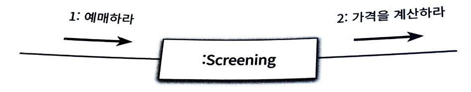

마찬가지로 **가격을 계산하는 데 필요한 정보의 전문가**를 찾아야 한다.  
이 경우, 영화의 가격을 잘 알고있는 `Movie` 객체에 책임을 할당한다.

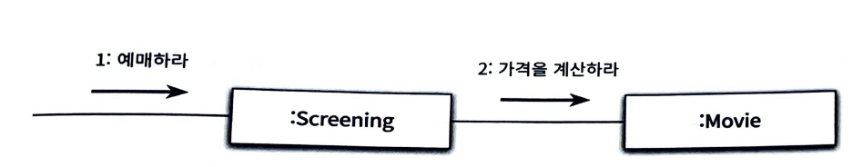

#### 3. 할인 여부를 판단하라

가격을 계산하기 위해 `Movie`가 어떤 작업을 해야 하는지 떠올려본다.

- 영화가 할인 가능한지 판단한다.
- 할인 정책에 따라 할인 요금을 제외한 금액을 계산한다.

하지만 여기서 `Movie`는 영화가 할인 가능한지 판단할 수 없다.  
따라서 **_할인 여부를 판단하라_** 는 메시지를 전송해서 외부의 도움을 요청해야 한다.

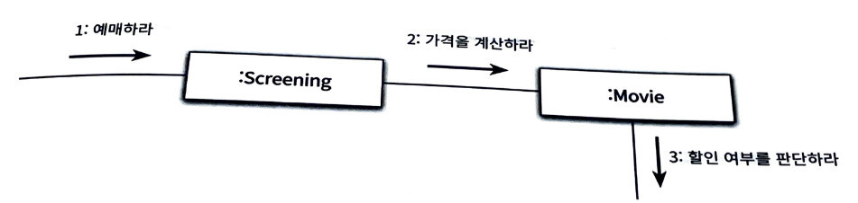

마찬가지로 **할인 여부를 판단하는 데 필요한 정보**를 가장 많이 알고있는 객체를 선택해야 한다.  
이 경우 할인 조건(`DiscountCondition`)이 정보 전문가가 된다.

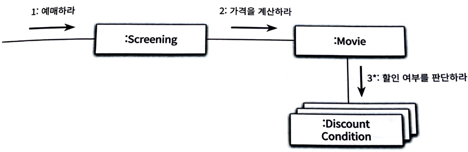

`DiscountCondition`은 **자신이 가진 정보만으로 책임을 수행할 수 있기 때문**에, 외부로 메시지를 전달하지 않는다.

> 이처럼 `INFORMATION EXPERT` 패턴을 따르는 것만으로도, **자율성이 높은 객체들로 구성된** 협력 공동체를 구축할 가능성이 높아진다.

## 높은 응집도와 낮은 결합도

실제로 설계를 진행하다 보면, 몇 가지 설계 중에서 한 가지를 선택해야 하는 경우가 발생한다.

- 예를 들어, 할인 요금을 계산하기 위해 `Movie`가 `DiscountCondition`에게 메시지를 전송한다.
- 하지만 이 설계 이외에도, `Screening`이 `DiscountCondition`에게 메시지를 전송하는 방법도 존재한다.

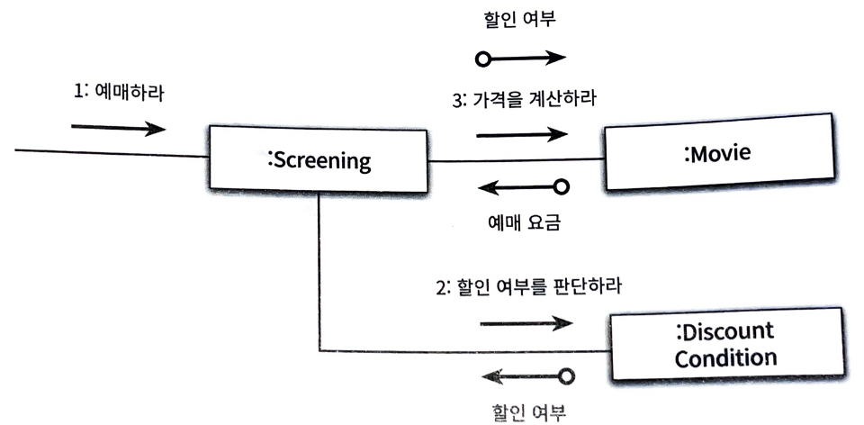

> 👉🏻 이 경우, `Screening`이 `DiscountCondition`에게 할인 여부를 판단하라는 메시지를 전송하고, 반환받은 할인 여부를 `Movie`에 전달해야 한다.

위 설계를 선택하지 않은 이유는 `응집도`와 `결합도`에 있다.

- 책임을 할당하는 다양한 대안이 존재한다면, **응집도와 결합도의 측면에서 더 나은 대안**을 선택하는 것이 좋다. 👉🏻 `LOW COUPLING`, `HIGH COHESION` 패턴

### LOW COUPLING

도메인 상으로 `Movie`는 `DiscountCondition`의 목록을 속성으로 포함하고 있다.

- 즉, `Movie`와 `DiscountCondition`은 이미 결합되어 있음

> 👉🏻 따라서 **이미 결합되어 있는** `Movie`와 `DiscountCondition`이 협력하게 하면, **설계 전체적으로 결합도를 추가하지 않고도 협력을 완성**할 수 있는 것이다.

### HIGH COHESION

`Screening`의 가장 중요한 책임은 예매를 생성하는 것이다.

만약 `Screening`이 `DiscountCondition`과 협력해야 한다면, `Screening`은 **영화 요금 계산과 관련된 책임 일부**를 떠안아야 한다.

- 이 경우, `Screening`은 `DiscountCondition`이 할인 여부를 판단할 수 있고, `Movie`가 이 할인 여부를 필요로 한다는 사실 역시 알고 있어야 한다. _(= 예매 요금 계산 과정을 모두 알고 있음)_

> 👉🏻 즉, **예매 요금을 계산하는 방식이 변경**될 경우, `Screening`도 함께 변경되어야 한다는 것이다.

반면, `Movie`의 **주된 책임은 영화 요금을 계산하는 것**이다.

- 따라서 영화 요금을 계산하는 데 필요한 조건을 판단하기 위해 `DiscountCondition`과 협력하는 것은 **응집도에 아무런 해도 끼치지 않는다.**

## 창조자에게 객체 생성 책임을 할당하라

`CREATOR` 패턴은 **객체를 생성할 책임을 어떤 객체에게 할당할지**에 대한 지침을 제공한다.

아래 항목을 가장 많이 만족하는 B에게 **A의 생성 책임**을 할당해야 한다.

- B가 A 객체를 포함하거나 참조한다.
- B가 A 객체를 기록한다.
- B가 A 객체를 긴밀하게 사용한다.
- B가 A 객체를 초기화하는 데 필요한 데이터를 가지고 있다 _(= B는 A에 대한 정보 전문가이다)_

> 생성하는 책임도 두 객체 사이의 관계를 생성한다.  
> 👉🏻 따라서, **이미 관계가 존재하는 객체에게** 생성 책임을 할당하라는 것이다.

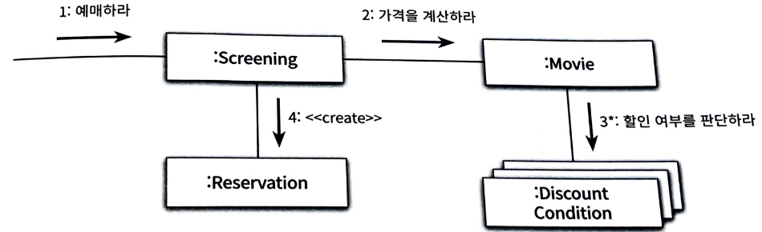

`Screening`은 예매 정보를 생성하는 데 필요한 정보의 전문가이다.

- 영화, 상영 시간, 상영 순번 등의 정보를 모두 가지고 있음

👉🏻 `Screening`을 `Reservation` 객체의 생성자로 결정

---

# 3. 구현을 통한 검증

## reserve 메시지를 수신하는 Screening

`Screening`은 영화를 예매할 책임을 맡으며 그 결과로 `Reservation` 인스턴스를 생성할 책임을 수행해야 한다. 즉, `Screening`은 예매에 대한 정보 전문가인 동시에 `Reservation`의 창조자다.

협력 관점에서 Screening은 예매하라 메시지에 응답할 수 있어야 한다.

[Screening의 예매하는 책임 구현](https://github.com/objects-book-study/practice-object-book/commit/b0b10e8ceeb854c2120920a320b11d367c76f390)

- Screening을 구현하는 과정에서 **Movie에 전송하는 메시지의 시그니처**를 `calculateMovieFee(Screening screening)` 으로 선언한 것을 확인할 수 있다.
  - 이 메시지는 수신자인 Movie가 아닌 **송신자인 Screening의 의도를 표현**한다.
  - 중요한 것은 Screening이 **Movie의 내부 구현에 대한 어떤 지식도 없이, 전송할 메시지를 결정했다**는 것이다.

```
👉🏻 내부 구현을 고려하지 않고 필요한 메시지를 결정하면, 객채의 내부 구현을 깔끔하게 캡슐화할 수 있다.
```

## calculateMovieFee 메시지를 수신하는 Movie

[Movie의 요금을 계산하는 책임 구현](https://github.com/objects-book-study/practice-object-book/commit/413591b00b4835026ce42accb1e1ad3d73074e57)

## isSatisfiedBy 메시지를 수신하는 DiscountCondition

[DiscountCondition의 할인 여부를 판단하는 책임 구현](https://github.com/objects-book-study/practice-object-book/commit/11025d36d3c3b5bd6ae9c502b96b37eba8f4d9ba)

## ⭐️ DiscountCondition 개선하기

현재 `DiscountCondition`은 **변경에 취약한 클래스**이다.

```
[ 변경에 취약한 클래스 ]

코드를 수정해야 하는 이유를 하나 이상 가지는 클래스
즉, 변경의 이유가 다양한 클래스
```

`DiscountCondition`는 아래 세 가지 이유로 변경될 수 있다. _(= 낮은 응집도)_

1. 새로운 할인 조건 추가
2. 순번 조건을 판단하는 로직이 변경되는 경우
3. 기간 조건을 판단하는 로직이 변경되는 경우

👉🏻 이는 곧 **서로 연관성이 없는 기능**이나 **데이터**가 하나의 클래스에 뭉쳐있다는 의미이다.

```
[ 낮은 응집도 문제 해결하기 ]

변경의 이유에 따라 클래스를 분리한다.
```

설계를 개선하는 작업은 `변경의 이유가 하나 이상인 클래스를 찾는 것`으로부터 시작하는 것이 좋다.

```
[ 클래스 응집도 판단하기 ]

클래스가 다음과 같은 징후로 몸살을 앓는다면, 클래스의 응집도는 낮은 것이다.

- 클래스가 둘 이상의 이유로 변경돼야 한다면, 응집도가 낮은 것
    👉🏻 변경의 이유를 기준으로 클래스를 분리

- 클래스의 인스턴스를 초기화하는 시점에 경우에 따라 서로 다른 속성들을 초기화하고 있다면, 응집도가 낮은 것
    👉🏻 초기화되는 속성의 그룹을 기준으로 클래스를 분리

- 메서드 그룹이 속성 그룹을 사용하는지 여부로 나뉜다면, 응집도가 낮은 것
    👉🏻 그룹을 기준으로 클래스를 분리
```

## 타입 분리하기

앞서 살펴본 내용을 기준으로 `DiscountCondition`을 살펴보면, 해당 클래스는 기간 조건인지, 순번 조건인지에 따라서 메서드 / 속성 그룹이 나뉜다.

따라서 그룹별로 클래스를 분리하여 각각 `PeriodCondition`, `SequenceCondition`을 정의한다.

[DiscountCondition 타입 분리](https://github.com/objects-book-study/practice-object-book/commit/fc7562d65c8fdeef28e03f0f40c33cd723c088f2)

이렇게 되면 `PeriodCondition`, `SequenceCondition` 클래스 모두 자신의 모든 인스턴스 변수를 생성자에서 초기화할 수 있다.

하지만 이렇게 응집도는 높아졌지만, **결합도는 높아진 것**을 확인할 수 있다. [👉🏻 관련 코드](https://github.com/objects-book-study/practice-object-book/blob/fc7562d65c8fdeef28e03f0f40c33cd723c088f2/minsan/ch05/%EB%8D%B0%EC%9D%B4%ED%84%B0%EC%A4%91%EC%8B%AC%EC%84%A4%EA%B3%84/Movie.java#L8-L9)

- 수정 후에 Movie는 `PeriodCondition`과 `SequenceCondition`과 의존 관계를 맺기 때문 _(기존에는 `DiscountCondition`만 관계를 맺음)_

## 다형성을 통해 분리하기

사실 Movie 입장에서는 **`SequenceCondition`과 `PeriodCondition`은 아무 차이도 없다.**

- 할인 여부를 판단하는 **동일한 책임**을 수행하고 있기 때문

👉🏻 결국 `Movie` 입장에서 두 클래스는 동일한 역할을 수행한다는 것이다.

- 앞선 장에서 "역할"은 `추상화`로 이어진다고 했다.

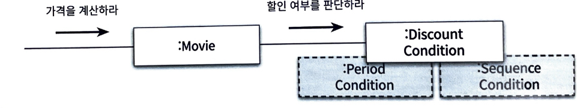

[DiscountCondition 다형성으로 결합 낮추기](https://github.com/objects-book-study/practice-object-book/commit/ee287ca3b73eb4362587ccd814b91aa0c15c0bf6)

이처럼 **객체의 타입에 따라 변하는 행동**이 있다면, **타입을 분리하고 변화하는 행동을 각 타입의 책임으로 할당**해야 한다. _(👉🏻 `POLYMORPHISM` 패턴)_

> 👉🏻 즉, 타입에 따라서 실행 로직이 달라지는 경우 `다형성` _(= 메시지 동일 & 내부 로직 다름)_ 으로 처리하라는 것이다.

## 변경으로부터 보호하기

앞서 `DiscountCondition`을 **인터페이스로 캡슐화**하였다.  
이로 인해 새로운 할인 조건이 추가되더라도 `Movie`는 영향을 받지 않는다.

이처럼 **인터페이스를 이용해 변경을 캡슐화하는 것**은 `PROTECTED VARIATIONS` 패턴에 해당한다.

## Movie 클래스 개선하기

Movie 역시 DiscountCondition과 동일한 문제를 가지고 있다.  
👉🏻 마찬가지로 `POLYMORPHISM` 패턴을 이용하여 **서로 다른 행동을 타입별로 분리**하고, `PROTECTED VARIATIONS` 패턴을 이용해 변화 지점을 캡슐화 한다.

[추상 클래스로 Movie 클래스 개선하기](https://github.com/objects-book-study/practice-object-book/commit/aa730775d9b70217d7af00438896907ad7025868)

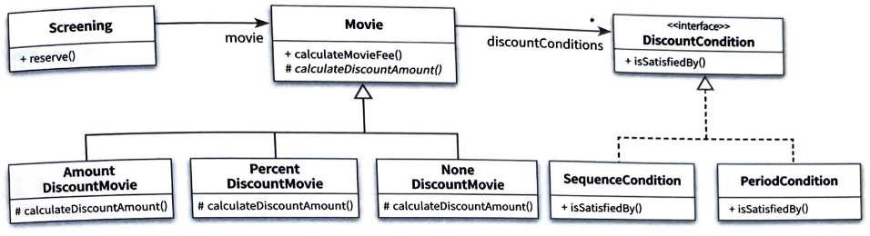

> 책임 중심으로 변경한 영화 예매 시스템 도메인

## 변경과 유연성

변경에 대비할 수 있는 방법 중 하나는, **코드를 수정하지 않고도** 변경을 수용할 수 있도록 코드를 더 유연하게 만드는 것이다.

만약 **영화에 설정된 할인 정책을 실행 중에 변경할 수 있어야 하는 요구사항**이 추가된다면, 지금 설계에서는 쉽지 않아 보인다.

- 추상 클래스의 `상속`을 이용하기 있기 때문에, 정책을 바꾸려면 새로운 인스턴스를 생성하고 의존성을 다시 주입해주어야 함

👉🏻 해결 방안은 상속 대신 `합성`을 이용하는 것

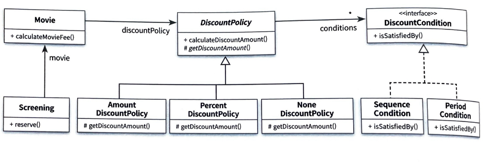

[합성을 이용하여 DiscountCondition 변경 유연성 높이기](https://github.com/objects-book-study/practice-object-book/commit/042fc0c58b713bf405331f9acde833b619879fb8)
